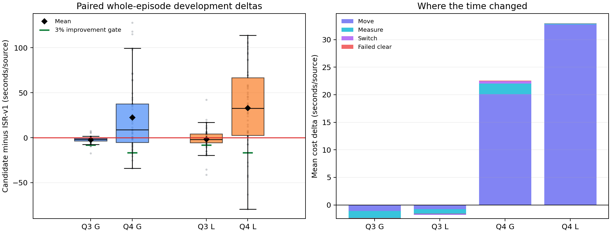

# B题 JSP 重构与验证报告

## 当前结论

JSP 已实现为独立候选，保留 ISR-v1、S3/S25 覆盖义务和确定性完成证书。监督学习只给合法候选排序，不能删除覆盖任务、写入频道状态或宣布频道不存在。

| 题目 | 开发集 ISR-v1 均值 | JSP-G | JSP-L | 开发门槛 | 当前处理 |
|---|---:|---:|---:|---|---|
| Q3，50 对 | 277.61 秒/源 | 275.24（−0.85%） | 276.05（−0.56%） | 至少 −3% | 不进入独立验收 |
| Q4，50 对 | 551.87 秒/源 | 574.40（+4.08%） | 584.84（+5.98%） | 至少 −3% | 不进入独立验收 |

Q3 三臂均为 50/50 局实际全清，最大费用恒等式残差为 `3.64e-12` 秒。JSP-G 的配对均值差 97.5% bootstrap 区间为 `[-3.66, -1.15]` 秒/源，说明小幅改善在该开发集内稳定，但预注册采用标准同时要求平均幅度至少 3%，因此仍判定不通过。JSP-L 没有比 JSP-G 额外降低 1%，不能优先采用。

Q4 三臂同样为 50/50 局实际全清，最大费用残差为 `9.09e-12` 秒。JSP-G 和 JSP-L 的 97.5% 配对均值差区间分别为 `[10.71, 35.00]` 和 `[18.19, 47.71]` 秒/源，区间完全位于零以上，即两个候选在开发集上都更慢。Q3、Q4 均无候选满足开发门，因此没有查看 `280000` 独立验收结果，也没有启动官方 30 局。

## 正确性与协议修复

两位小数示向统一使用 ±1.01° 外包角带。覆盖记录要求站点索引合法、坐标与 S3/S25 点吻合，并且频道测量已被接受。官方响应的虚拟时间必须存在、有限且单调；`/enter` 的剩余时长必须存在、有限且为正。

通信异常、业务拒绝、缺字段、非法 bearing、时间倒退、数值几何异常和证书违例使用不同异常类型。通信与协议异常直接向上传播；证书内清除失败使候选验收失败；只有数值几何异常允许进入保守光学保底。官方 runner 在算法失败后仍尝试一次 `/exit` 并单独记录退出结果。

以提交 `c88abfa71c79366909cf99708b490e46bc29938f` 的模块快照和协议修复后的当前 ISR-v1，各自运行 Q3/Q4 的开发段与既有回归段共 500 局。两份逐局记录的源数、成功状态、清除数、虚拟时间、距离、测量、切频、清除调用、失败试清和费用残差全部在 `1e-9` 容差内逐项相同，实际最大差为 0。因此正常路径基线不需要因协议修复重新定标。

几何保证的适用假设与证书口径见 `docs/JSP_GEOMETRIC_ASSUMPTIONS.md`。

## 可中断定位与联合调度

双侧定位被改写为显式状态机，保存首次示向锚点、局部坐标系、硬多边形、距离区间、轮次中点、两个冻结探点、待执行侧、已处理响应和末端清除进度。重复响应相同时幂等，冲突响应触发证书违例。同轮第一侧 `no_signal` 后可以换频道或执行扫描，恢复时仍执行原来冻结的第二侧；其他位置的阴性观测不能与它拼接。

每轮从最多 64 个合法动作生成至多 8 个评分候选：ISR-v1 的下一任务、最近最多 8 个覆盖站的 4 频道分段与整站扫描，以及每个已发现源的单步定位和连续完成。距离只进入评分，不能阻止较远源进入合法候选池。确定性清除证书具有最高优先级。

JSP-G 使用公开几何、动作费用、双侧剩余轮次和开放路线代理做保守排序；JSP-L 使用相同动作池。每局最多 100 次新增调度和 32 次定位中断或扫描分段。单次规划超过 0.25 秒、累计超过 10 秒、模型异常或特征越界后，从当前状态按 ISR 规则继续，不重置观测、频道、定位轮次或已发生费用。

## 监督学习数据

原计划训练段 `290000–290255` 中的种子 `290000` 曾被采集器 smoke 使用。虽然 smoke 不参与选型，仍按预注册占用规则将训练和校准整段增加 10000，最终冻结为：

- 训练：`300000–300255`，每题 256 场；
- 校准：`301000–301063`，每题 64 场；
- 每个场景分别采集 JSPBASE 与 JSP-G 轨迹，每条轨迹最多 4 个均匀决策快照；
- 每个快照最多 8 个分支，执行一个候选后由同一 ISR 续跑器完成整局。

绝对坐标版特征、原种子版数据和曾过滤远距离单步定位的候选池数据均保留在名称明确包含 `aborted` 或 `invalid` 的目录中，不用于训练、开发选型或采用结论。

Q3 最终数据包含 640 个轨迹案例和 16342 条完整后缀标签。分支键无重复，分支与标签一一对应，每个快照恰有一个零差基线，全部后缀完成证书通过，种子覆盖完整，最大费用残差为 `3.64e-12` 秒。

Q3 固定 `HistGradientBoostingRegressor` 的校准结果为：MAE 97.39 秒、RMSE 143.44 秒、偏差 −14.40 秒、候选两两排序准确率 70.69%。校准快照上按预测最优候选的实际平均差为 +4.00 秒，显示学习排序存在明显决策风险。没有重新拟合、搜索参数或增加样本。

Q4 最终数据包含 640 个轨迹案例和 16748 条完整后缀标签，全部完整性检查通过，最大费用残差为 `1.46e-11` 秒。Q3、Q4 合计 1280 个轨迹案例、33090 条完整后缀标签，采集墙钟分别为 883.36 秒和 1939.74 秒，低于 4 小时预算和 40960 条上限。

Q4 固定模型的校准结果为：MAE 157.08 秒、RMSE 260.36 秒、偏差 −2.24 秒、候选两两排序准确率 68.38%。校准快照中按预测最优候选的实际平均差为 −7.02 秒，但平均选择遗憾为 99.67 秒，P95 选择遗憾为 496.75 秒。整局开发结果证明这种局部平均优势不能转化为可靠的整局提速。

## Q3 费用来源

相对 ISR-v1，JSP-G 每源平均变化为：移动 −1.07 秒、测量 −1.40 秒、切频 +0.01 秒、失败试清 +0.09 秒，合计 −2.37 秒/源。JSP-L 为：移动 −0.77 秒、测量 −1.00 秒、切频 +0.13 秒、失败试清 +0.09 秒，合计 −1.55 秒/源。

JSP-G 的 960 次记录事件中，298 次保持基线扫描、647 次保持基线连续定位、3 次采用有界单步定位中断、12 次执行确定性优先清除。JSP-L 的 992 次事件中，93 次采用学习预测动作、875 次因预测收益不足 1 秒保留基线、23 次确定性优先清除、1 局因输入越界停用模型并完成 ISR 回退。

## Q4 费用来源

Q4 JSP-G 相对 ISR-v1 每源平均增加：移动 +20.12 秒、测量 +1.88 秒、切频 +0.46 秒、失败试清 +0.07 秒，合计 +22.53 秒/源。其 2025 次记录事件包含 198 次单步定位中断；这些中断产生回程和后续路线重排，额外移动是主要退化来源。

Q4 JSP-L 每源平均增加：移动 +32.78 秒、测量 +0.14 秒、切频 −0.01 秒、失败试清 +0.07 秒，合计 +32.98 秒/源。学习器在 1932 次记录事件中有 212 次宣称至少 1 秒收益并改变选择，但最终多走约 2194 米/局。监督标签只展开一个候选动作后交回 ISR 续跑，无法充分刻画多次在线改序叠加造成的路径回摆，这是局部标签与整局策略失配的主要证据。

两题所有 300 次最终开发运行均实际全清，JSP 的光学几何保底触发次数为 0。Q3 JSP-L 有 1 局因特征越界回退、1 局因单次规划超过 0.25 秒回退；Q4 JSP-G/JSP-L 各有 1 局触发单次规划预算回退。回退后均从当前状态完成 ISR 确定性流程，没有重置观测或计时。程序耗时 P95 均低于 10 秒门槛：Q3 JSP-G/JSP-L 为 0.52/0.82 秒，Q4 为 2.23/2.62 秒。

## 独立验收与官方演练

预注册规则要求候选先在 50 对开发集相对 ISR-v1 至少提速 3%。Q3 最好结果为 −0.85%，Q4 最好结果为 +4.08%，因此两题都未获得独立验收资格。`280000–280199`、`281000–281029`、`281100–281129` 未运行，不能把本轮写成 520 次独立验收或压力测试。

官方 30 局同样没有启动。批处理、公共锁、数据库归属核对、实际剩余时间截止、模型哈希预检和断点续跑代码已经完成并通过故障测试，但没有官方 JSP 成绩。最终推荐 Q3、Q4 都继续使用 ISR-v1；JSP 作为可复用研究候选保留，不替换现有基线、论文或提交包。

最终测试目录共 77 项通过。全仓 `pytest` 通过 `pytest.ini` 限定为正式 `tests/`，避免历史原型目录中同名 `stress_test.py` 的导入冲突。

复跑、独立验收、官方首次启动与断点恢复命令见 `docs/JSP_RUNBOOK.md`。
